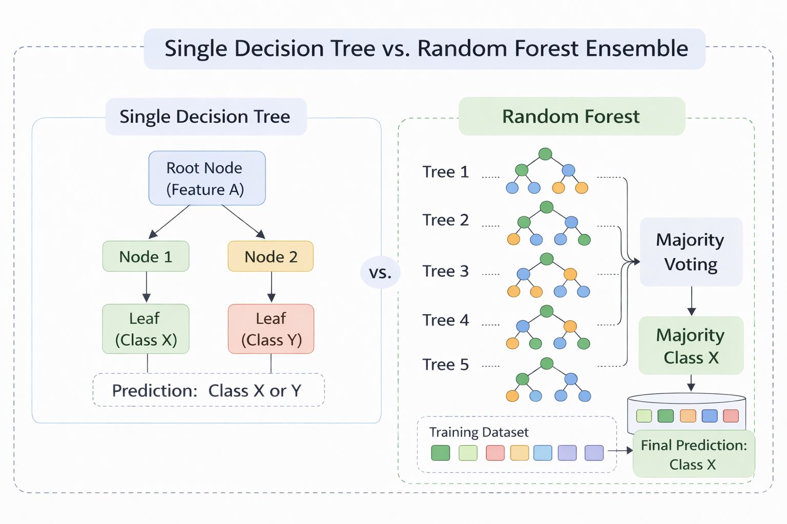
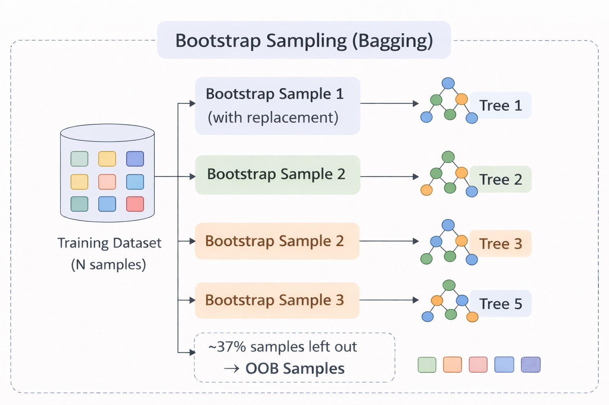
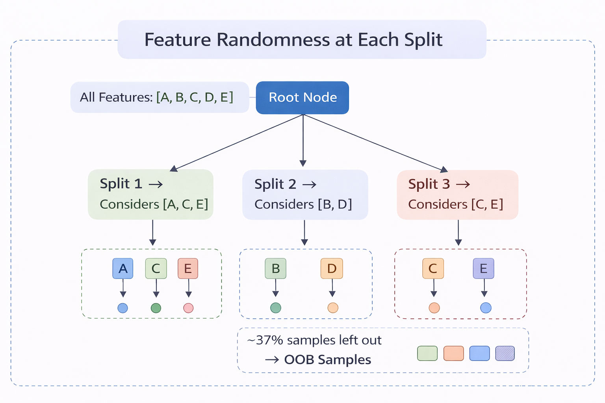
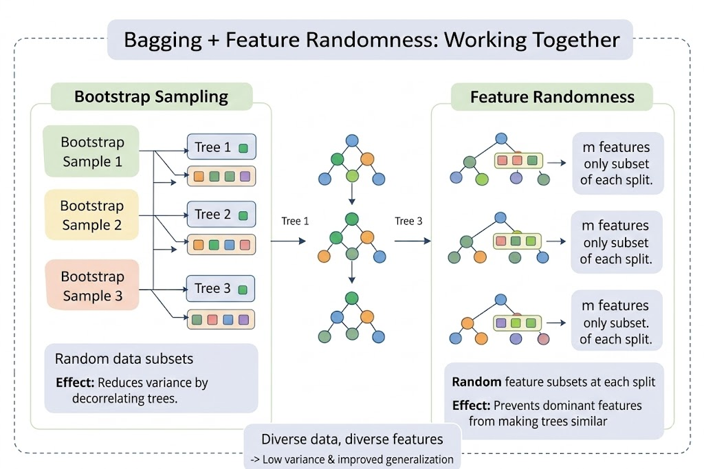
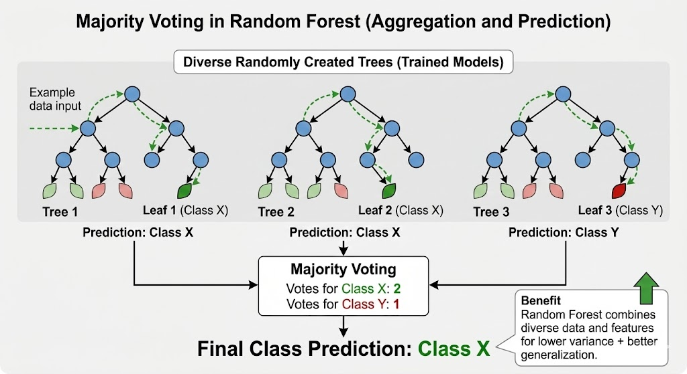

A Random Forest is a supervised ensemble learning algorithm used for both classification and regression tasks. Instead of relying on a single decision tree (which can easily overfit the training data), Random Forest builds many decision trees during training and combines their outputs to produce a more accurate and stable prediction. Each individual tree in the forest may be a relatively weak learner on its own, but when many such trees vote together, the ensemble becomes a strong learner with significantly improved generalisation.

### 1. From a Single Decision Tree to a Forest

A single Decision Tree learns by recursively splitting data on features to create decision rules. While simple and interpretable, it has a key limitation: high variance. Small changes in training data can produce a completely different tree, leading to overfitting. Random Forest addresses this by building an ensemble of many decision trees and aggregating their predictions. The core idea is:

> Many weak learners, each slightly different, can combine to form one strong learner.

The two sources of randomness that make the trees diverse are Bootstrap Sampling (Bagging) and Random Feature Selection, explained below.

Figure 1 - A single Decision Tree (left) vs. a Random Forest ensemble (right). Each tree votes independently and the final prediction is made via majority voting.

### 2. Bootstrap Sampling (Bagging)

Bagging (Bootstrap Aggregating) is the first source of randomness. For each tree in the forest:

1. A bootstrap sample is created by randomly selecting N samples with replacement from the original training set of N samples.
2. On average, each bootstrap sample contains about 63% of unique training samples (since sampling is with replacement, some samples appear more than once and some are left out).
3. The remaining ~37% of samples that are not selected for a given tree are called Out-of-Bag (OOB) samples. These act as a built-in validation set for that tree.

Figure 2 - Bootstrap sampling: each tree receives a different random subset (with replacement) of the training data. Unselected samples become OOB samples.

Because each tree is trained on a different subset, the trees learn slightly different patterns, making their errors less correlated. When combined, the variance of the overall model drops significantly.

### 3. Random Feature Selection

The second source of randomness occurs at every split during tree construction. Instead of evaluating all available features to find the best split, each node only considers a random subset of m features (typically m = √p for classification, where p is the total number of features).

This prevents dominant features from appearing at the root of every tree, forcing the forest to explore a wider variety of feature interactions. Without this step, all trees would look very similar despite using different bootstrap samples.

Figure 3 - At each node, only a random subset of features (highlighted) is evaluated. Different nodes and different trees use different subsets.

### 4. Bagging + Feature Randomness: Working Together

The power of Random Forest comes from combining both sources of randomness:

| Source of Randomness | What it does | Effect |
|---|---|---|
| Bootstrap Sampling | Each tree trains on a different data subset | Reduces variance by decorrelating trees |
| Feature Randomness | Each split considers a random feature subset | Prevents dominant features from making trees similar |
| Combined Effect | Trees are diverse in both data and features | Ensemble is robust, low-variance, and generalises well |

Figure 4 - Random Forest = Bagging (different data subsets) + Feature Randomness (different feature subsets at each split). This dual randomness produces a diverse, high-performing ensemble.

### 5. Splitting Criteria

At each node, the best split is chosen from the randomly selected feature subset using an impurity measure. The two commonly used criteria are:

Gini Impurity measures the probability of misclassifying a randomly chosen sample:

<svg class="formula-svg" width="170" height="68" viewBox="0 0 170 68" xmlns="http://www.w3.org/2000/svg" role="img" aria-label="Gini equals 1 minus the summation from i equals 1 to C of p sub i squared">
  <rect width="170" height="68" fill="#f3f3f3"/>
  <text x="10" y="42" font-family="Cambria Math, Times New Roman, Georgia, serif" font-size="22" font-style="italic" fill="#222">Gini</text>
  <text x="57" y="42" font-family="Cambria Math, Times New Roman, Georgia, serif" font-size="22" fill="#222">= 1 −</text>
  <text x="108" y="42" font-family="Cambria Math, Times New Roman, Georgia, serif" font-size="42" fill="#222">∑</text>
  <text x="126" y="11" font-family="Cambria Math, Times New Roman, Georgia, serif" font-size="17" font-style="italic" fill="#222">C</text>
  <text x="121" y="62" font-family="Cambria Math, Times New Roman, Georgia, serif" font-size="14" font-style="italic" fill="#222">i=1</text>
  <text x="139" y="42" font-family="Cambria Math, Times New Roman, Georgia, serif" font-size="22" font-style="italic" fill="#222">p</text>
  <text x="150" y="48" font-family="Cambria Math, Times New Roman, Georgia, serif" font-size="13" font-style="italic" fill="#222">i</text>
  <text x="157" y="28" font-family="Cambria Math, Times New Roman, Georgia, serif" font-size="15" fill="#222">2</text>
</svg>

where pᵢ is the proportion of samples belonging to class i, and C is the total number of classes. A Gini value of 0 indicates a perfectly pure node (all samples belong to one class). Higher values indicate more impurity.

Entropy measures the amount of uncertainty or disorder in a node:

<svg class="formula-svg" width="278" height="68" viewBox="0 0 278 68" xmlns="http://www.w3.org/2000/svg" role="img" aria-label="Entropy equals minus the summation from i equals 1 to C of p sub i log base 2 of p sub i">
  <rect width="278" height="68" fill="#f3f3f3"/>
  <text x="10" y="42" font-family="Cambria Math, Times New Roman, Georgia, serif" font-size="22" font-style="italic" fill="#222">Entropy</text>
  <text x="92" y="42" font-family="Cambria Math, Times New Roman, Georgia, serif" font-size="22" fill="#222">= −</text>
  <text x="126" y="42" font-family="Cambria Math, Times New Roman, Georgia, serif" font-size="42" fill="#222">∑</text>
  <text x="144" y="11" font-family="Cambria Math, Times New Roman, Georgia, serif" font-size="17" font-style="italic" fill="#222">C</text>
  <text x="139" y="62" font-family="Cambria Math, Times New Roman, Georgia, serif" font-size="14" font-style="italic" fill="#222">i=1</text>
  <text x="157" y="42" font-family="Cambria Math, Times New Roman, Georgia, serif" font-size="22" font-style="italic" fill="#222">p</text>
  <text x="168" y="48" font-family="Cambria Math, Times New Roman, Georgia, serif" font-size="13" font-style="italic" fill="#222">i</text>
  <text x="177" y="42" font-family="Cambria Math, Times New Roman, Georgia, serif" font-size="22" font-style="italic" fill="#222">log</text>
  <text x="209" y="48" font-family="Cambria Math, Times New Roman, Georgia, serif" font-size="13" fill="#222">2</text>
  <text x="216" y="42" font-family="Cambria Math, Times New Roman, Georgia, serif" font-size="22" fill="#222">(</text>
  <text x="223" y="42" font-family="Cambria Math, Times New Roman, Georgia, serif" font-size="22" font-style="italic" fill="#222">p</text>
  <text x="234" y="48" font-family="Cambria Math, Times New Roman, Georgia, serif" font-size="13" font-style="italic" fill="#222">i</text>
  <text x="242" y="42" font-family="Cambria Math, Times New Roman, Georgia, serif" font-size="22" fill="#222">)</text>
</svg>

Entropy is 0 for a pure node and reaches its maximum when classes are equally distributed. Information Gain, which is the reduction in entropy after a split, is used to select the best feature and threshold.

Both criteria generally produce similar trees. Gini is computationally slightly faster (no logarithm), while Entropy tends to produce more balanced splits.

### 6. Prediction Mechanism

Once all trees are trained, a new sample is passed through every tree in the forest:

- Classification: Each tree votes for a class. The class with the majority of votes becomes the final prediction.
- Regression: Each tree outputs a numeric value. The average of all outputs is the final prediction.

Figure 5 - Prediction via majority voting: each tree votes independently, and the class with the most votes wins.

#### Example

Suppose a Random Forest contains 5 trees and predicts whether an email is Spam or Not Spam:

| Tree | Prediction |
|------|------------|
| Tree 1 | Spam |
| Tree 2 | Not Spam |
| Tree 3 | Spam |
| Tree 4 | Spam |
| Tree 5 | Not Spam |

Majority vote = Spam (3 out of 5 trees). Even though two trees predicted "Not Spam", the ensemble correctly classifies the email by following the majority.

### 7. Out-of-Bag (OOB) Error Estimation

A unique advantage of Random Forest is built-in cross-validation through OOB samples. Since each tree was trained on only ~63% of the data, the remaining ~37% (OOB samples) can be used to evaluate that tree's performance without needing a separate validation set.

The OOB error is computed by:
1. For each training sample, collecting predictions only from trees where it was not in the bootstrap sample.
2. Using majority voting on those predictions to classify the sample.
3. Computing the overall misclassification rate.

The OOB error is an unbiased estimate of the generalisation error and closely approximates leave-one-out cross-validation.

### 8. Key Hyperparameters

| Parameter | Description | Typical Values |
|---|---|---|
| n_estimators | Number of trees in the forest | 100–500 (more trees → better accuracy, diminishing returns) |
| max_features | Number of features considered at each split | √p (classification), p/3 (regression) |
| max_depth | Maximum depth of each tree | None (grow fully) or limited to prevent overfitting |
| min_samples_split | Minimum samples required to split a node | 2–10 |
| min_samples_leaf | Minimum samples required at a leaf node | 1–5 |

Increasing n_estimators generally improves performance but increases computation time. Reducing max_features increases tree diversity but may reduce individual tree accuracy. The balance between these parameters is key to a well-performing Random Forest.

### 9. Algorithm

Step 1: Set parameters:
n = number of trees to build
m = number of features to consider at each split (usually √total_features for classification)

Step 2: For each tree i = 1 to n:

Step 2a: Bootstrap Sampling
Randomly select N samples with replacement from training data
This creates a different dataset for each tree
About 37% of original data is left out (Out-of-Bag samples)

Step 2b: Build Decision Tree with Random Feature Selection
At each node:
Randomly select m features from all features
Find the best split using ONLY these m features
Split the node
Grow tree fully (no pruning)

Step 3: Store all n trees

Step 4: For prediction (Classification):
Pass new sample through all trees
Each tree gives one vote
Final prediction = class with majority votes

Step 5: For prediction (Regression):
Pass new sample through all trees
Each tree gives one numeric prediction
Final prediction = average of all tree predictions

Step 6: Evaluate using OOB Error:
For each sample, aggregate predictions from trees that did not include it
Compute misclassification rate as OOB error estimate

Step 7: Calculate Feature Importance:
For each feature, sum up how much it reduced impurity across all trees

### 10. Decision Tree vs. Random Forest

| Aspect | Single Decision Tree | Random Forest |
|---|---|---|
| Model Type | Single model | Ensemble of many trees |
| Variance | High (sensitive to data changes) | Low (averaging reduces variance) |
| Overfitting | Prone to overfitting | Resistant due to bagging + randomness |
| Accuracy | Moderate | Generally higher |
| Interpretability | Easy (one tree to follow) | Harder (many trees) |
| Training Time | Fast | Slower (many trees) |
| Feature Importance | Available but unstable | Stable and reliable |

### 11. Merits of Random Forest

- High Accuracy & Robustness: Combining multiple trees reduces overfitting and usually gives better accuracy than a single decision tree.
- Handles Large & Complex Data: Works well with large datasets and can handle both numerical and categorical features.
- Feature Importance Estimation: Measures the importance of each feature based on impurity reduction, aiding feature selection.
- Built-in Validation: OOB error provides a reliable generalisation estimate without needing a separate validation set.
- Minimal Preprocessing: Does not require feature scaling or normalisation.

### 12. Demerits of Random Forest

- Computationally Expensive: Training many trees requires more time and memory compared to simpler models.
- Less Interpretability: The ensemble nature makes it harder to interpret compared to a single decision tree.
- Not Ideal for Real-Time Prediction: Multiple trees increase prediction latency.
- Large Model Size: Storing hundreds of trees consumes more memory than a single model.
